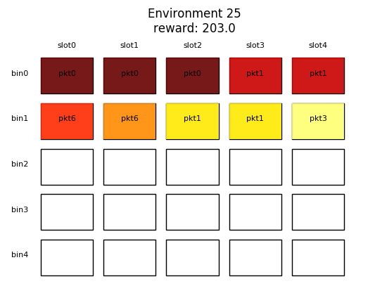

# BinPacking_Neural_Combinatorial_Optimization
Bin Packing Problem using Neural Combinatorial Optimization.

This Tensorflow model tackles Bin-Packing Problem using Reinforcement Learning. It trains multi-stacked LSTM cells to perform an RNN agent able to embed information from the environment and variable size sequences batched form the whole combinational input space.

This AI is performed to behave like a first-fit algorithm.
https://en.wikipedia.org/wiki/Bin_packing_problem#First-fit_algorithm

<p align="center">
  

My special greetings to Michel Deudon (@mdeudon) & Pierre Cournut (@pcournut) for their inspirational TSP implementation.
https://github.com/MichelDeudon/neural-combinatorial-optimization-rl-tensorflow

# Requirements 

- Python 3.6
- Tensorflow 1.8.0
- Minizinc 2.1.1 (optional -> --enable_performance)
````
    pip install -r requirements.txt
````
# Usage
Test pretained model performance:
```
    python main.py --train_mode=False --load_model=True (--enable_performance=True)
```

Train your own model from scratch:
```
    python main.py --train_mode=True --save_model=True
```

Continue training a previously saved model:
```
    python main.py --train_mode=True --save_model=True --load_model=True
```
# Debug

To visualize training variables on Tensorboard:
```
    tensorboard --logdir=summary/repo
```

To activate Tensorflow debugger in Tensorboard, uncomment TensorBoard Debug Wrapper code. Execute Tensorboard after running the model.
```
    tensorboard --logdir=summary/repo --debugger_port 6064
```
# Results

Solutions are tested againt Gecode open-source constraint solver.


**Performance obtained is over 80%.**

# Author

Ruben Solozabal, PhD student at the University of the Basque Country [UPV/EHU] Bilbao

Date: October 2018

Contact me: rubensolozabal@gmail.com

# References

Bello, I., Pham, H., Le, Q. V., Norouzi, M., & Bengio, S. (2016). Neural combinatorial optimization with reinforcement learning. arXiv preprint arXiv:1611.09940.

Azalia Mirhoseini, Hieu Pham, Quoc Le, Mohammad Norouzi, Samy Bengio, Benoit Steiner,
Yuefeng Zhou, Naveen Kumar, Rasmus Larsen, and Jeff Dean, Device placement optimization
with reinforcement learning, 2017.

